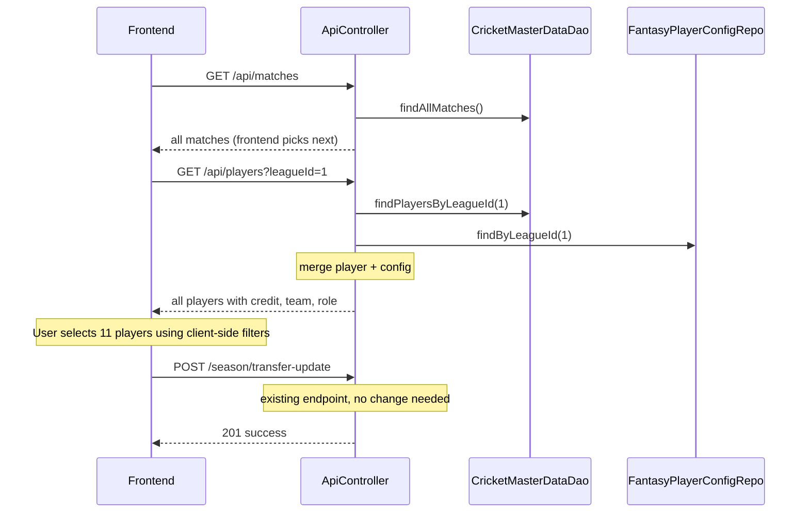

# Fantasy League UI API Endpoints (Simplified)

Single controller at `src/main/java/com/cricket/fantasyleague/controller/ApiController.java` with base path `/api`. All endpoints require JWT. **7 endpoints total.**

Approach: Bulk data loading (like IPL Fantasy) — one call loads all players/matches, frontend handles filtering/sorting client-side. No server-side filter endpoints needed.

---

## 1. GET /api/matches — All matches (bulk)

Powers: schedule page, match selector dropdown, upcoming/completed filtering on UI.

- Returns: `[ { id, date, time, venue, result, toss, isMatchComplete, teamA: {id, name, shortName}, teamB: {id, name, shortName} } ]`
- Source: `CricketMasterDataDao.findAllMatches()` + `CricketEntityMapper.toMatch()`
- Frontend derives: upcoming, completed, today, next match — all from this single response

## 2. GET /api/players?leagueId= — All players with config (bulk)

Powers: team creation page with all client-side filters (by team, role, overseas, credit, uncapped).

- Returns: `[ { id, name, role, teamId, teamName, teamShortName, credit, overseas, uncapped, totalPoints, isActive } ]`
- Source: `CricketMasterDataDao.findPlayersByLeagueId()` joined with `FantasyPlayerConfigRepository.findByLeagueId()` + `CricketMasterDataDao.findTeamsByPlayerId()` for team info
- Frontend derives: team filter list (unique teamName values), role filter, overseas toggle, credit sort — all from this single response. No separate `/api/teams` endpoint needed.

## 3. GET /api/me — Current user profile + overall stats

Powers: header bar (username, points), profile page.

- Returns: `{ id, username, firstname, lastname, email, favteam, totalPoints, prevPoints, boosterLeft, transferLeft }`
- Source: Username from JWT SecurityContext -> `UserRepository.findByUsername()` + `UserOverallStatsRepository.findByUserid()`

## 4. GET /api/me/draft — Current draft team for next match

Powers: "My Team" page showing the team user has built for the upcoming match.

- Returns: `{ matchId, matchDate, teamA, teamB, playing11: [{id, name, role}], captainId, viceCaptainId, tripleScorerId, booster, transfersUsed }` or empty if no draft exists
- Source: `MatchService.findNextUpcomingMatch()` + `UserMatchStatsDraftRespository.findByMatchidAndUserid()`

## 5. GET /api/me/history — All past match results for this user

Powers: match history page, per-match breakdown.

- Returns: `[ { matchId, date, teamA, teamB, matchPoints, boosterUsed, transfersUsed, captainId, viceCaptainId, playing11: [{id, name}] } ]`
- Source: `UserMatchStatsRespository.findByUserid(User)` (new repo method needed)

## 6. GET /api/leaderboard — Overall user rankings

Powers: leaderboard page.

- Returns: `[ { rank, userId, username, firstname, totalPoints } ]`
- Source: `UserOverallStatsRepository.findAll()` sorted by totalPoints desc

## 7. GET /api/points/{matchId} — Player points for a match

Powers: match detail page showing how each player scored, points breakdown.

- Returns: `[ { playerId, playerName, role, points } ]`
- Source: `PlayerPointsRepository.findByMatchId()` + player name from DAO

---

## Repository Change Needed

One addition:

- **`UserMatchStatsRespository`** — add `findByUserid(User user)` returning `List<UserMatchStats>`

---

## Data Flow (Create Team page)

---

## Summary

| # | Endpoint | Purpose |
|---|----------|---------|
| 1 | GET /api/matches | All matches (bulk) |
| 2 | GET /api/players?leagueId= | All players + config (bulk) |
| 3 | GET /api/me | User profile + overall stats |
| 4 | GET /api/me/draft | Current draft team |
| 5 | GET /api/me/history | Past match results |
| 6 | GET /api/leaderboard | User rankings |
| 7 | GET /api/points/{matchId} | Match player points |

**Existing endpoint reused:** `POST /season/transfer-update` (team create/update) — no new write endpoint needed.
**New repo method:** 1 (`findByUserid`)
**New file:** 1 (`ApiController.java`)
